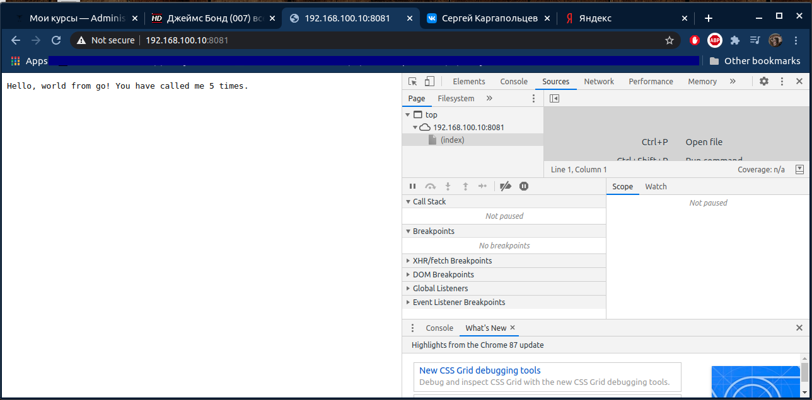
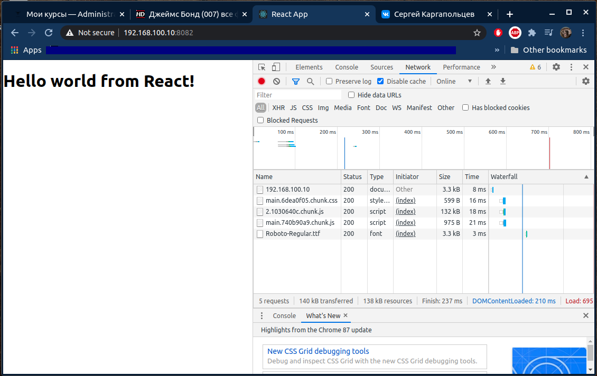
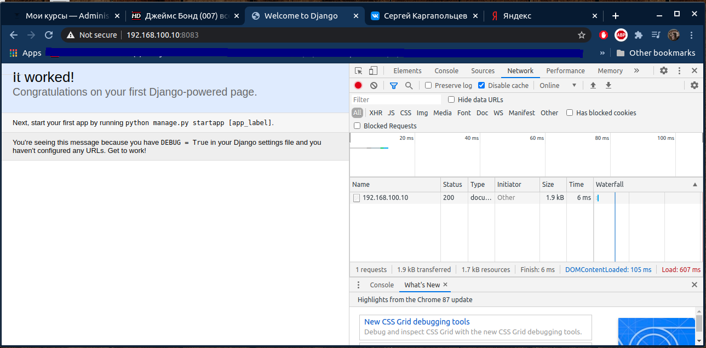

# Динпамический WEB

развернуть стенд с веб приложениями в vagrant
Варианты стенда
nginx + php-fpm (laravel/wordpress) + python (flask/django) + js(react/angular)
nginx + java (tomcat/jetty/netty) + go + ruby
можно свои комбинации

Реализации на выбор
- на хостовой системе через конфиги в /etc
- деплой через docker-compose

Для усложнения можно попросить проекты у коллег с курсов по разработке

К сдаче примается
vagrant стэнд с проброшенными на локалхост портами
каждый порт на свой сайт
через нжинкс

# Решение

Поднимаем стенд

    $ vagrant up

- В данной реализации использовались: Go, Django и React
- Каждое web-приложение после запуска стенда доступно на своём порту
- go - http://192.168.100.10:8081

- react - http://192.168.100.10:8082

- django - http://192.168.100.10:8083

Конфиги под каждое web-приложение копирутся в /etc/nginx/conf.d

Основной сложностью было быстро разобраться как запускаются простые страницы под этими web-средами. И конечно-же руками это сделать проще и быстрее, чем автоматизировать. 

